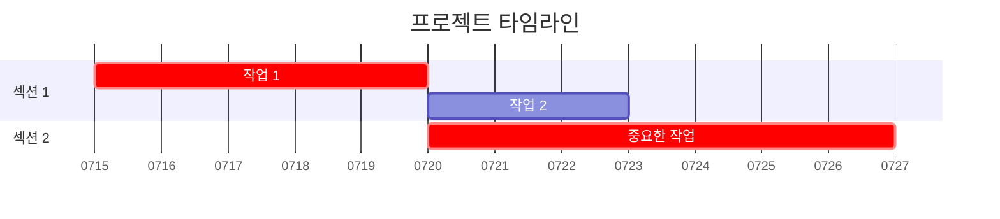
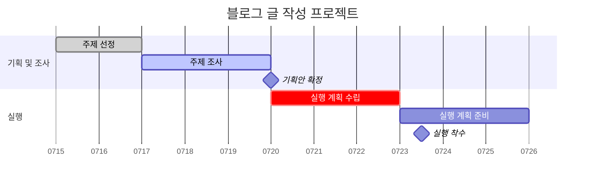

---
tags:
  - 경상대
  - 옵시디언강의
aliases:
  - 간트차트 만들기
---

### 1. 간트 차트란?
간트 차트는 프로젝트의 일정을 시각적으로 보여주는 막대 차트입니다. 
어떤 작업을 언제 시작해서 언제 끝내야 하는지, 작업 간의 의존성은 어떻게 되는지 한눈에 파악할 수 있어 프로젝트 관리에 매우 유용합니다.

### 2. 기본 구조
옵시디언에서 간트 차트를 만들려면 `mermaid` 코드 블록을 사용합니다.

```


-   `gantt`: 간트 차트를 그리겠다고 선언합니다.
-   `title`: 차트의 전체 제목을 지정합니다.
-   `dateFormat`: 차트에서 사용할 날짜 형식을 정의합니다. 
	- `YYYY-MM-DD`가 가장 일반적입니다.
-   `section`: 관련된 작업들을 그룹화합니다.

### 3. 작업(Task) 정의 문법
작업은 `작업 이름 : 상태, 아이디, 시작 조건, 기간` 형식으로 정의합니다.

-   **작업 이름**: 표시될 작업의 이름입니다.
-   **상태 (선택 사항)**: 작업의 상태를 표시합니다.
    -   `done`: 완료된 작업
    -   `active`: 현재 진행 중인 작업
    -   `crit`: 매우 중요한 작업 (보통 붉은색으로 강조됨)
-   **시작 조건**:
    -   **특정 날짜**: `2024-07-15`와 같이 날짜를 직접 지정합니다.
    -   **다른 작업 이후**: `after ID` 형식으로 특정 작업이 끝난 후에 시작하도록 설정합니다. 이를 위해 참조할 작업에 ID를 부여해야 합니다. (예: `작업 A : a1, ...` -> `작업 B : after a1, ...`)
-   **기간**: 작업에 소요되는 시간입니다.
    -   `d`: 일 (e.g., `10d`는 10일)
    -   `w`: 주 (e.g., `2w`는 2주)
    -   `h`: 시간, `m`: 분, `s`: 초 등도 사용할 수 있습니다.

### 4. 마일스톤(Milestone)
마일스톤은 프로젝트의 중요한 중간 목표나 이벤트를 표시하며, 기간이 없습니다.

-   문법: `마일스톤 이름 : milestone, 날짜`

### 5. 종합 예시
아래는 위 문법들을 활용한 종합적인 간트 차트 예시 코드입니다.

```


위와 같이 코딩하면 다음 그림처럼 보이게 됩니다.


메뉴로 : [[00_옵시디언을 이용한 지식관리]]
이전강의 : [[13_그래프 뷰(Graph View)- 내 지식의 연결망 시각화하고 해석하기]]
다음강의 : [[15_커뮤니티 플러그인 생태계 이해 및 설치 시 주의사항]]